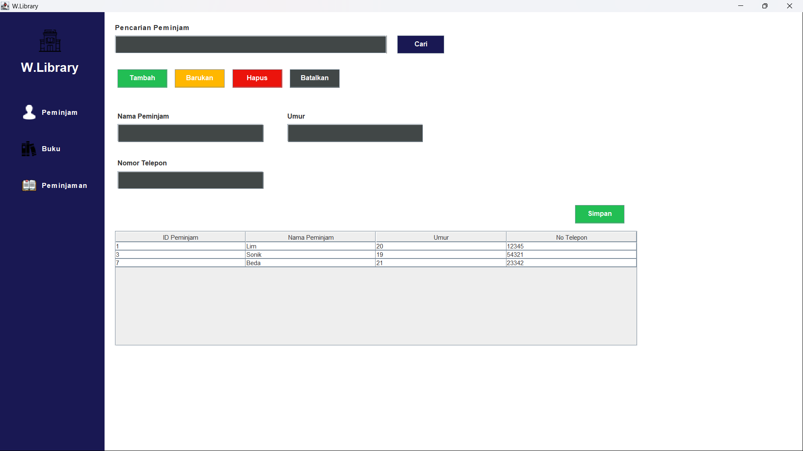
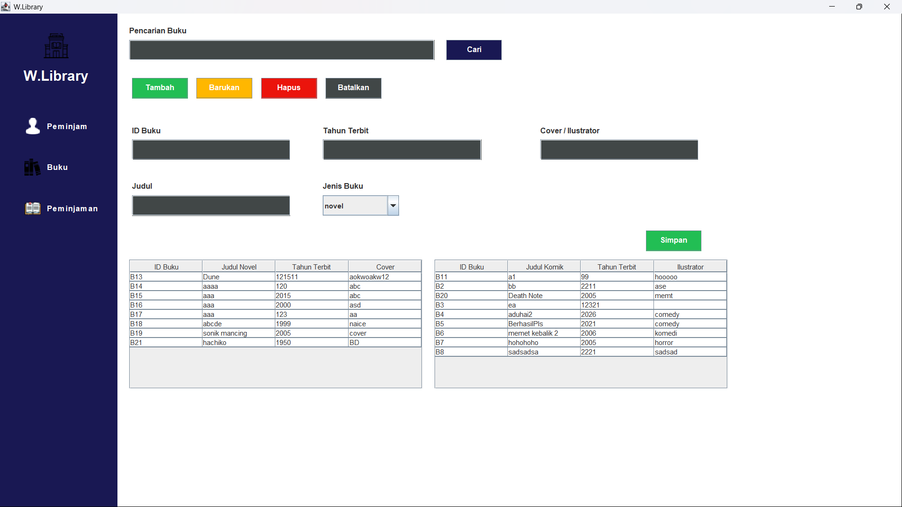
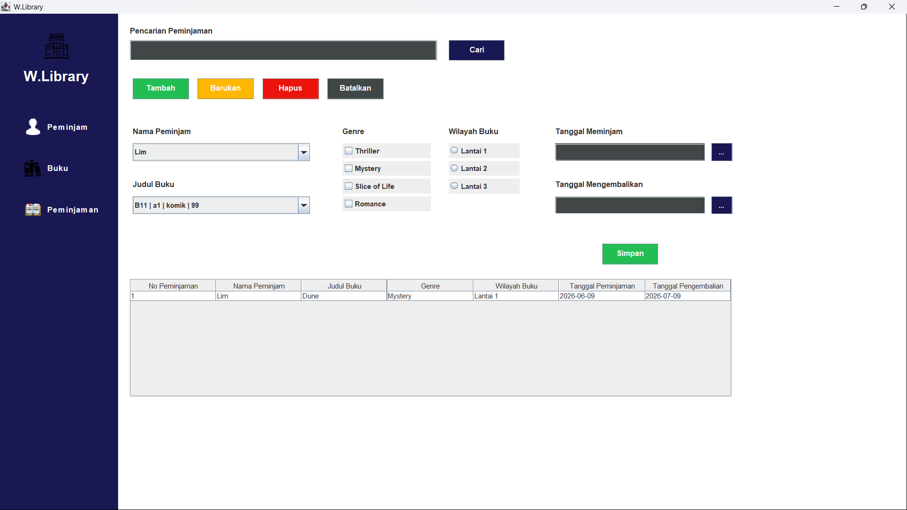

# Library Management System

Library Management System is a Java Swing desktop application designed to manage library data, including books, borrowers, and borrowing records. This project implements Object-Oriented Programming concepts and Object Persistence using a MySQL database.

The application provides a simple interface for managing library data through CRUD operations, search features, and database integration using JDBC and the DAO pattern.

## Features

### Borrower Management

* Add new borrower data
* Update existing borrower data
* Delete borrower data
* Search borrower data
* Display borrower records in a table

### Book Management

* Add new book data
* Update existing book data
* Delete book data
* Search book data
* Manage different book types such as Novel and Comic

### Borrowing Management

* Add borrowing records
* Select borrower and book data
* Input borrowing and return dates
* Select book genre using checkboxes
* Select book location using radio buttons
* Display borrowing records in a table

## Built With

* Java
* Java Swing
* MySQL
* JDBC
* MySQL Connector
* IntelliJ IDEA

## Main Concepts Implemented

* Object-Oriented Programming
* Encapsulation
* Inheritance
* Polymorphism
* Relation
* Exception Handling
* Object Persistence
* CRUD Operations
* Search Feature
* DAO Pattern
* Controller Layer
* Java Swing GUI
* MySQL Database Integration
* Custom Table Model using `AbstractTableModel`

## Project Structure

```text
src
├── Connection
│   └── DBConnection.java
│
├── Controller
│   ├── BukuController.java
│   ├── PeminjamController.java
│   └── PeminjamanController.java
│
├── Dao
│   ├── BukuDAO.java
│   ├── PeminjamDAO.java
│   └── PeminjamanDAO.java
│
├── Exception
│   └── Custom exception classes
│
├── Icon
│   └── Application icons
│
├── InterfaceDao
│   └── DAO interfaces
│
├── Model
│   ├── Buku.java
│   ├── Novel.java
│   ├── Komik.java
│   ├── Peminjam.java
│   └── Peminjaman.java
│
├── PanelView
│   ├── BukuMainPanel.java
│   ├── PeminjamMainPanel.java
│   └── PeminjamanMainPanel.java
│
├── Table
│   └── TablePeminjaman.java
│
└── View
    └── MainViewForm.java
```

## Database Design

The application uses a MySQL database to store and manage library data. The main tables include:

* `Buku`
* `Novel`
* `Komik`
* `Peminjam`
* `Peminjaman`

The `peminjaman` table stores borrowing records and connects borrower data with book data. It contains information such as borrower ID, book ID, borrowing date, return date, book genre, and book location.

## Application Preview

application screenshots:





## Notes

This project focuses on implementing Object Persistence in a desktop-based Java application. The data is not only displayed in the GUI, but also stored, retrieved, updated, and deleted from a MySQL database using JDBC and the DAO pattern.

## Author

Created by Beda Arya Wimala.
